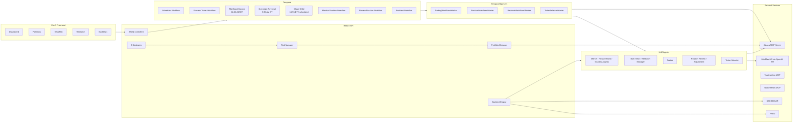
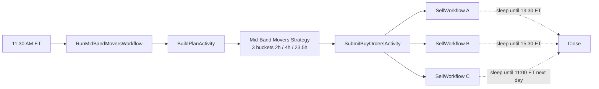
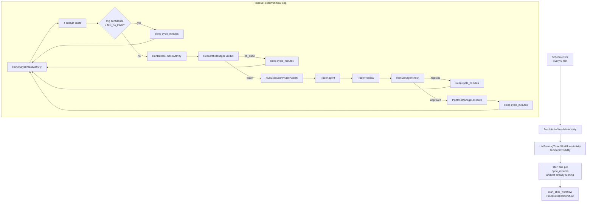
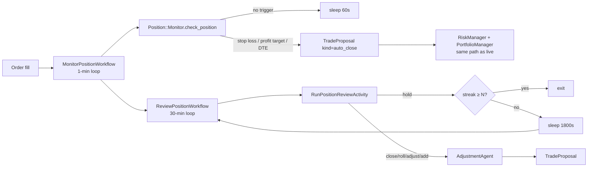
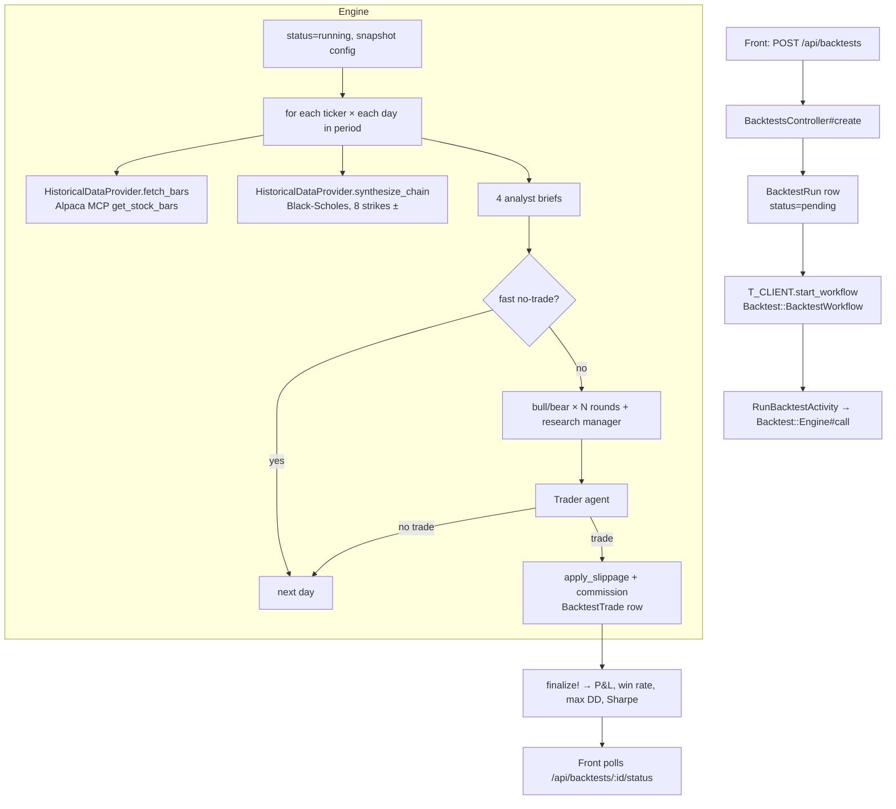

# Yield-paca — Multi-Agent AI Trading System on Alpaca MCP

Built for the **Alpaca AI Trading Agents Hackathon** (Aug 28 – Sep 4, 2026). A paper account (ID `PA3PR2RMFE9Y`) runs **three production strategies** against US equity options through Alpaca's MCP server — two deterministic (Mid-Band Movers, Overnight Reversal) and one full multi-agent LLM pipeline (Bull/Bear-Debate-Driven Ticker Pipeline). The same engine replays itself against historical data for backtesting.

```
Trading window: Mon Aug 31 9:30am ET → Fri Sep 4 9:30am ET
Paper account:  PA3PR2RMFE9Y
```

## Architecture at a glance



Five Docker services: `postgres`, `temporal`, `alpaca-mcp`, `api`, `front`.

## Tech stack

| Layer             | Choice                                                                                                      |
| ----------------- | ----------------------------------------------------------------------------------------------------------- |
| API               | Rails 8.1, Ruby 4.0.6 (YJIT), bootsnap                                                                      |
| Database          | Postgres 18                                                                                                 |
| Orchestration     | Temporal (Cloud for prod, containerized dev)                                                                |
| LLM               | MiniMax-M3 via OpenAI-compatible endpoints                                                                  |
| LLM framework     | `ruby_llm-mcp` for tool discovery                                                                           |
| MCP servers       | `alpaca-mcp` (orders/data), `tradingview-mcp` (screener), `optionsflow-mcp` (sentiment), `fred-mcp` (macro) |
| HTTP (FRED/EDGAR) | Faraday                                                                                                     |
| Rate limiting     | Custom token bucket per source                                                                              |
| Circuit breaker   | 3-state, per source, with back-off                                                                          |
| Front-end         | Vue 3 + Vite + Naive UI + Pinia + ECharts                                                                   |

## Repository layout

```
trader/
├── docker-compose.yml      # 5 services
├── .env / .env.example     # shared env
├── mcp/                    # Alpaca MCP server container (uvx)
├── api/                    # Rails 8 app
│   ├── Dockerfile
│   ├── Gemfile             # no versions except ruby "4.0.6"
│   ├── Procfile            # worker: bin/worker, web: rails s
│   ├── bin/worker          # auto-discovers app/workers/*.rb
│   ├── config/
│   │   ├── trading.yml     # ALL prompts + thresholds (single source of truth)
│   │   ├── database.yml    # ENV["DATABASE_URL"]
│   │   └── initializers/   # temporal, ruby_llm, alpaca_mcp, rate_limiter, circuit_breaker, trading_config
│   ├── db/migrate/         # 22 migrations
│   └── app/
│       ├── models/                 # 10 AR models
│       ├── controllers/api/        # 10 JSON controllers
│       ├── agents/                 # 11 LLM agents + base
│       │   ├── base.rb             # uniform .call(*, workflow_id:, run_id:)
│       │   ├── ticker_selector.rb
│       │   ├── trader.rb
│       │   ├── analyst/            # market_data, news, macro, insider
│       │   ├── debate/             # bull, bear, research_manager
│       │   └── position/           # position_review, adjustment
│       ├── backtest/               # engine, historical_data_provider, black_scholes
│       ├── ticker_selector/        # universe_provider, filter_engine
│       ├── position/               # monitor, review, adjustment
│       ├── risk/                   # risk_manager, risk_decision (Data.define)
│       ├── portfolio/              # portfolio_manager (deterministic executor)
│       ├── workflows/              # Temporal workflows (one per logical loop)
│       │   ├── application_workflow.rb
│       │   ├── ticker_selector/ticker_selector_workflow.rb
│       │   ├── trading/{scheduler_workflow,process_ticker_workflow}.rb
│       │   ├── position/{monitor_position_workflow,review_position_workflow}.rb
│       │   └── backtest/backtest_workflow.rb
│       ├── activities/             # Temporal activities (one per external call)
│       │   ├── application_activity.rb
│       │   ├── ticker_selector/    # fetch_universe, apply_filters, rank_candidates, persist_watchlist
│       │   ├── trading/            # fetch_active_watchlist, list_running, run_analyst_phase, run_debate_phase, run_execution_phase
│       │   ├── position/           # run_position_monitor, run_position_review
│       │   └── backtest/           # run_backtest
│       └── workers/                # 4 workers (one per task queue group)
│           ├── application_worker.rb
│           ├── ticker_selector_worker.rb      # trading-queue
│           ├── trading_workflows_worker.rb    # trading-queue
│           ├── position_workflows_worker.rb   # position-queue
│           └── backtest_workflows_worker.rb   # backtest-queue
└── front/                  # Vue 3 SPA
    ├── Dockerfile
    ├── vite.config.ts      # /api proxy → VITE_API_PROXY_TARGET
    └── src/
        ├── api/            # client.ts (fetch wrapper), types.ts
        ├── stores/         # 9 Pinia stores (dashboard, positions, orders, watchlist, research, agentRuns, system, config, backtests)
        ├── views/          # 10 views
        │   ├── DashboardView.vue
        │   ├── PositionsView.vue
        │   ├── PositionDetailView.vue
        │   ├── OrdersView.vue
        │   ├── WatchlistView.vue
        │   ├── ResearchView.vue
        │   ├── AgentRunsView.vue
        │   ├── SystemView.vue
        │   ├── ConfigView.vue
        │   ├── BacktestsView.vue
        │   └── BacktestDetailView.vue
        └── router/         # 10 routes
```

## Configuration

Everything that can be tuned lives in `api/config/trading.yml`. The path is overridable via the `TRADING_CONFIG_PATH` env var. ERB is supported for env interpolation. The file is loaded once at boot into the `TRADING_CONFIG` constant; `TradingConfig.fetch(:risk_limits, :max_open_positions)` reads from it.

Top-level sections (the new ones added for the workflow / backtest work are marked **★**):

```
llm:            provider, model, timeouts
workflow:       tick intervals, position hold/cooldown, scheduler stagger
analyst_agents: market_data, news, macro, insider (enabled + prompts)
debate_agents:  bull, bear, research_manager
trader_agent:   prompt
position_review_agent / adjustment_agent: prompts
ticker_selector: universe, filters, prompts
risk_limits:    max positions, notional, daily loss, Greeks
scheduler:    ★ batch_size, batch_gap_seconds, within_batch_gap_ms, cycle_interval_seconds
debate:       ★ rounds, fast_no_trade_avg_confidence
macro:        ★ FRED series to pull
agents:       ★ flat prompt map keyed by agent_key (derived from class name)
position_monitor:  frequency_minutes, interval_seconds, hard_exits
position_review:   frequency_minutes, interval_seconds, exit_after_hold_cycles
rate_limits:  per-source token bucket params
circuit_breaker: failure threshold, reset, back-off
backtest:     default_period_days, slippage, commission, fill_model, start_of_day_equity
alpaca_mcp:   server URL, readonly vs trading toolsets
```

## Strategies

Three production strategies run on the same paper account, each through its own Temporal cron schedule. They share the same `Risk::RiskManager` and `Portfolio::PortfolioManager` gates, and the same `AlpacaMirror` audit loop.

### 1. Mid-Band Movers — deterministic, scheduled at 11:30 AM ET



- Picks yesterday's top movers, filters to optionable universe, drops the top/bottom tails (`drop_top_pct: 5`, `drop_bottom_pct: 60`)
- Splits survivors into 3 buckets with hold-times 2h / 4h / 23.5h
- Buys ATM 0DTE/30DTE long calls sized off `options_buying_power × total_risk_pct`
- Each order spawns a `SellWorkflow` child that sleeps to its planned `planned_sell_at`, then submits `sell_to_close`
- Implementation: `app/strategies/mid_band_movers/`, `app/workflows/mid_band_movers/`, `app/activities/mid_band_movers/`

### 2. Overnight Reversal — deterministic, scheduled at 9:35 AM ET

```mermaid
flowchart LR
  Cron[9:35 AM ET] --> Run[RunOvernightReversalWorkflow]
  Run --> BP[BuildPlanActivity<br/>screener yesterday's movers]
  BP --> Probe[Eligibility probe<br/>DTE 0/3/7/14/30/60]
  Probe --> Plan[Plan: 10 winners + 10 losers]
  Plan --> Submit[SubmitOrdersActivity<br/>winners = long calls<br/>losers = bear-call spreads]
  Submit --> Children[Spawn CloseOvernightReversalWorkflow<br/>sleeps until 15:55 ET]
  Children --> Close[ClosePositionsActivity<br/>sell_to_close + buy_to_close]
```



- Yesterday's top **winners** → ATM long calls (long bias on reversal)
- Yesterday's top **losers** → bear-call credit spreads (defined-risk short bias, $5 width)
- Per-name eligibility probe that walks DTE windows [0, 3, 7, 14, 30, 60] requiring broker `ask_size ≥ 5` contracts
- `CloseOvernightReversalWorkflow` child sleeps to 15:55 ET, then flattens every `origin='overnight_reversal'` position
- Implementation: `app/strategies/overnight_reversal/`, `app/workflows/overnight_reversal/`, `app/activities/overnight_reversal/`

### 3. Bull/Bear Debate-Driven Ticker Pipeline — LLM, scheduled every 15 min

This is the **full multi-agent pipeline** that runs against every watchlist ticker the TickerSelector picks each morning. (See the next section for the per-phase detail.)

```
FetchMarketState → RunAnalystPhase (4 specialists in parallel)
  → RunDebatePhase (Bull + Bear argue; Research Manager synthesizes)
  → RunExecutionPhase (Trader LLM designs a multi-leg structure)
  → RiskManager (deterministic: per-leg options_approved_level check,
                  max_position_pct, max_open_positions, decision_ttl)
  → PortfolioManager (deterministic: re-verify, submit via MCP)
```

- **Bull Researcher** + **Bear Researcher** agents argue in parallel, each citing the same four analyst briefs and addressing each other's prior arguments
- **Research Manager** synthesizes a typed `ResearchPlan` (direction, confidence, key catalysts, invalidation conditions)
- **Trader** LLM designs the concrete structure (`vertical` / `iron_condor` / etc.), sized off live `options_buying_power`
- Deterministic Risk + Portfolio gates before the broker call
- Position review (every 30 min) re-runs the Bull/Bear pattern on open positions

All three strategies flow through the same `RiskManager + PortfolioManager` stack — there's exactly one execution pipeline, three ways to source trade ideas.

## Multi-agent trading pipeline

The full pipeline runs per ticker in `Trading::ProcessTickerWorkflow`, fanned out by `Trading::SchedulerWorkflow`.



### 11 LLM agents + 3 deterministic services (14 total in the pipeline)

| Stage             | Agent               | Tool access                 |
| ----------------- | ------------------- | --------------------------- |
| Universe          | (TickerSelector)    | Alpaca assets, FRED         |
| Analyst           | MarketDataAnalyst   | MCP read-only (chain, bars) |
| Analyst           | NewsAnalyst         | MCP read-only (news)        |
| Analyst           | MacroAnalyst        | FRED (Faraday)              |
| Analyst           | InsiderAnalyst      | EDGAR (Faraday)             |
| Debate            | BullResearcher      | none — pure LLM             |
| Debate            | BearResearcher      | none — pure LLM             |
| Debate            | ResearchManager     | none — single-shot gate     |
| Trader            | Trader              | none — single-leg proposal  |
| Position          | PositionReviewAgent | none — 30-min check         |
| Position          | AdjustmentAgent     | none — proposes new leg     |
| TickerSel         | TickerSelector      | Alpaca assets, FRED         |
| **Deterministic** | RiskManager         | reads `trading.yml` limits  |
| **Deterministic** | PortfolioManager    | trading MCP (broker)        |
| **Deterministic** | PositionMonitor     | refresh + breach rules      |

Every LLM call goes through:

- `TradingConfig.fetch(:llm, :default_model)` for the model
- `RATE_LIMITERS[:llm].with_limit(timeout:)` for the token bucket
- `CIRCUIT_BREAKERS[:llm].call { ... }` for fault isolation

## Position management

When `PortfolioManager` submits a fill, an `Order` row is created and the `Risk` + `Portfolio` row are linked. Two workflows then take over.



The two workflows run on different task queues (`trading-queue` vs `position-queue`) so the cheap 1-min loop never competes with the expensive 30-min LLM call.

## Watchlist selection

`TickerSelectorWorker` runs a daily workflow at 8am ET (cron in `trading.yml -> ticker_selector.run_at`). The pipeline:

1. `FetchUniverseActivity` — pulls Alpaca active US equities
2. `ApplyFiltersActivity` — runs the configured filter set (IV rank, market cap, options chain liquidity, etc.)
3. `RankCandidatesActivity` — `TickerSelectorAgent` LLM ranks and explains
4. `PersistWatchlistActivity` — deactivates yesterday's `WatchlistEntry` rows and inserts the new top N (capped at 500) with `cycle_minutes` assigned per filter priority

The Scheduler only launches per-ticker workflows for entries that are `active` (`effective_from ≤ today AND (effective_until IS NULL OR effective_until ≥ today)`).

## Backtest engine

Full multi-agent pipeline replay against historical data, one trading day at a time, with realistic fill simulation.



Key design choices:

- **Historical options chains** are not reliably available from Alpaca's MCP; we synthesize them with Black-Scholes (constant IV placeholder, configurable per call). When a real historical options source is wired in, only `synthesize_chain` needs to change.
- **Per-trade fill model** is `trading.yml -> backtest.fill_model` (`mid` / `ask_for_buys` / `bid_for_sells`) with `slippage_pct` and `commission_per_contract`.
- **Run on `backtest-queue`**, not `trading-queue`, so a 30-day backtest can't starve the live pipeline.
- **Per-trade `holding_minutes` and P&L** persisted to `backtest_trades`; aggregate stats on `backtest_runs` (`final_equity`, `total_pnl`, `win_rate`, `max_drawdown`, `sharpe`).

## Front-end

The Vue SPA polls the JSON API (no WebSockets). The default `vite.config.ts` proxies `/api/*` to `http://localhost:3000`; in compose the proxy target is overridden to `http://api:3000`.

Nav (left sider):

```
Dashboard        /                  live KPIs
Positions        /positions         open positions
Position detail  /positions/:id     Greeks + reviews
Orders           /orders            order history
Watchlist        /watchlist         active + recommendations
Research         /research          plans, cases, analyst reports
Agent Runs       /agents            recent LLM runs (filterable)
Backtests        /backtests         history + "run new" form
                 /backtests/:id     detail + equity curve + trade log
System           /system            health + rate limits (1h/24h/7d)
Config           /config            full `trading.yml` as a JSON tree
```

SystemView polls `/api/system/health` every 5s from `App.vue`. BacktestDetailView polls `/api/backtests/:id/status` every 5s while the run is `running` or `pending` and stops when it reaches a terminal state.

## Running the project

### Prerequisites

- Docker + Docker Compose
- An Alpaca paper account (API key + secret)
- A MiniMax (or other OpenAI-compatible) API key

### One-time setup

```bash
cd trader
cp .env.example .env
# Edit .env — set:
#   ALPACA_API_KEY / ALPACA_API_SECRET
#   MINIMAX_API_KEY
# Optionally: TEMPORAL_ADDRESS (defaults to temporal:7233 in the compose net)

docker compose build api front
docker compose up -d
docker compose exec api bundle install
docker compose exec api bundle exec rails db:create db:migrate
docker compose exec api bundle exec rails generate rspec:install   # if you want specs
```

### Daily operation

```bash
# Tail logs
docker compose logs -f api
docker compose logs -f front

# Open shells
docker compose exec api bash
docker compose exec front sh

# Trigger a watchlist refresh (otherwise waits for 8am ET cron)
docker compose exec api bundle exec rails runner "TickerSelector::TickerSelectorWorkflow.new.execute"

# Trigger a backtest from the host
curl -X POST http://localhost:3000/api/backtests \
  -H "Content-Type: application/json" \
  -d '{"tickers":["SPY","QQQ"],"period_days":30,"start_of_day_equity":100000,"name":"smoke"}'

# Cancel a running backtest
curl -X POST http://localhost:3000/api/backtests/1/cancel
```

### URLs

| Service     | URL                                |
| ----------- | ---------------------------------- |
| Front-end   | http://localhost:5173              |
| API         | http://localhost:3000/api/...      |
| Temporal UI | http://localhost:8233              |
| Postgres    | localhost:5432 (user/pass in .env) |

## Environment variables

All services read from the shared `.env` via `env_file: .env` in compose. Highlights:

```
POSTGRES_USER, POSTGRES_PASSWORD, POSTGRES_DB
DATABASE_URL                # api reads this; falls back to PG_* if not set
ALPACA_API_KEY, ALPACA_SECRET_KEY   # mcp server reads; client does not pass headers
ALPACA_PAPER=true
MINIMAX_API_KEY, MINIMAX_API_BASE   # api ruby_llm reads
TEMPORAL_ADDRESS, TEMPORAL_NAMESPACE, TEMPORAL_TASK_QUEUE
TRADING_CONFIG_PATH         # override path to trading.yml (default: config/trading.yml)
VITE_API_PROXY_TARGET       # front vite dev proxy target
```

## API endpoints

```
GET    /api/dashboard
GET    /api/positions
GET    /api/positions/:id
GET    /api/orders
GET    /api/orders/:id
GET    /api/research
GET    /api/agent_runs
GET    /api/agent_runs/:id
GET    /api/watchlist
GET    /api/watchlist/recommendations
GET    /api/system/health
GET    /api/rate_limits/stats
GET    /api/config
GET    /api/backtests
POST   /api/backtests                  # {tickers, period_days, mode, start_of_day_equity, name}
GET    /api/backtests/:id
GET    /api/backtests/:id/trades
GET    /api/backtests/:id/status
POST   /api/backtests/:id/cancel
```

## Temporal workers + task queues

| Worker                  | Task queue     | Owns                                                                                                                                                                     |
| ----------------------- | -------------- | ------------------------------------------------------------------------------------------------------------------------------------------------------------------------ |
| TickerSelectorWorker    | trading-queue  | daily ticker selection workflow + 4 activities                                                                                                                           |
| TradingWorkflowsWorker  | trading-queue  | Scheduler + ProcessTicker + 5 trading activities                                                                                                                         |
| PositionWorkflowsWorker | position-queue | RunMidBandMovers + MidBandMovers Sell + RunOvernightReversal + CloseOvernightReversal + RunMidBandMovers + Monitor + Review position + 7 ovn activities + 1 mbm activity |
| BacktestWorkflowsWorker | backtest-queue | Backtest + 1 activity                                                                                                                                                    |

Position-queue is the busy queue — it owns all three strategy runtimes plus the monitor/review workflows.

`bin/worker` (no args) auto-discovers every concrete worker in `app/workers/` from the filename: `trading_workflows_worker.rb` → `TradingWorkflowsWorker`. The `Procfile` runs `bundle exec bin/worker` for the `worker` process.

## Database schema (22 tables)

```
agent_runs                  tool_calls
trade_proposals             risk_decisions
positions                   position_reviews
portfolio_snapshots         research_plans
bull_cases                  bear_cases
analyst_reports             orders
fills                       watchlist_entries
watchlist_recommendations   backtest_runs
backtest_trades             + others
```

Key relationships:

- `TradeProposal` → `AgentRun` (which agent made it) + `closes_position` (Position it closes)
- `Position` ↔ `PositionReview` (review history)
- `BacktestRun` → `BacktestTrade` (one-to-many)
- `RiskDecision` → `TradeProposal` (audit trail of every check)
- `WatchlistEntry` (active rows) + `WatchlistRecommendation` (audit trail)

## Operations

- **Kill switch**: create the file `api/tmp/kill_switch` to halt new entries. `Risk::RiskManager` checks for it before every check. To resume: `rm api/tmp/kill_switch`.
- **Rate limit dashboard**: `/api/rate_limits/stats?window=1h|24h|7d` shows per-source acquired/denied token counts and current circuit-breaker states.
- **Circuit breaker**: opens after 3 consecutive failures, resets after 60s; after 5 open cycles the reset window back-offs to 5 minutes.
- **Trading halt**: setting `pause_after_risk_rejections` in `trading.yml` causes the workflow to pause after N consecutive rejections.

## Known limitations / future work

- Historical options chains are synthesized via Black-Scholes with a flat-IV assumption. Wire in Polygon/ORATS for a real backtest.
- Per-ticker `cycle_minutes` is currently static; the engine doesn't adjust based on volatility.
- The `Backtest::Engine` doesn't persist the full daily equity curve — the front-end derives it from the trade log. Add a `backtest_equity_points` table if precise intra-day equity is needed.
- No multi-leg strategies in the backtest path yet — the trader emits a single OCC leg, and the engine treats it as such.
- The front-end uses polling (5–30s) instead of WebSockets; this is intentional (no ActionCable), but realtime updates from a workflow completion event would be nicer.

## License & credits

Hackathon project; no license. Alpaca paper trading only. Third-party models, data sources, and tools are used under their respective terms.
